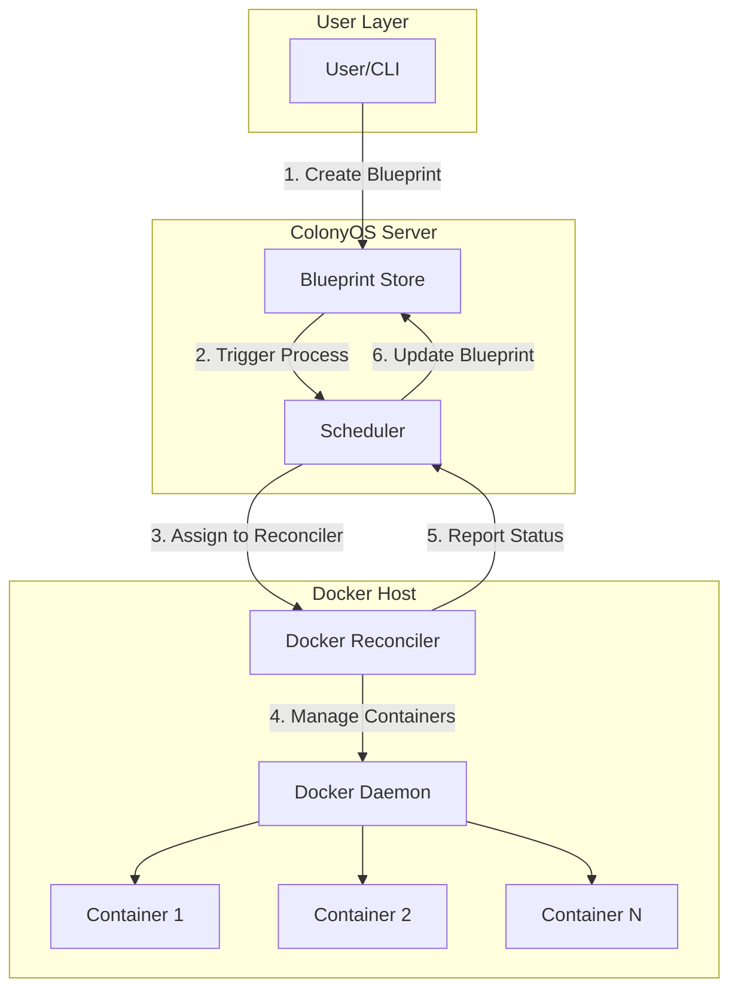
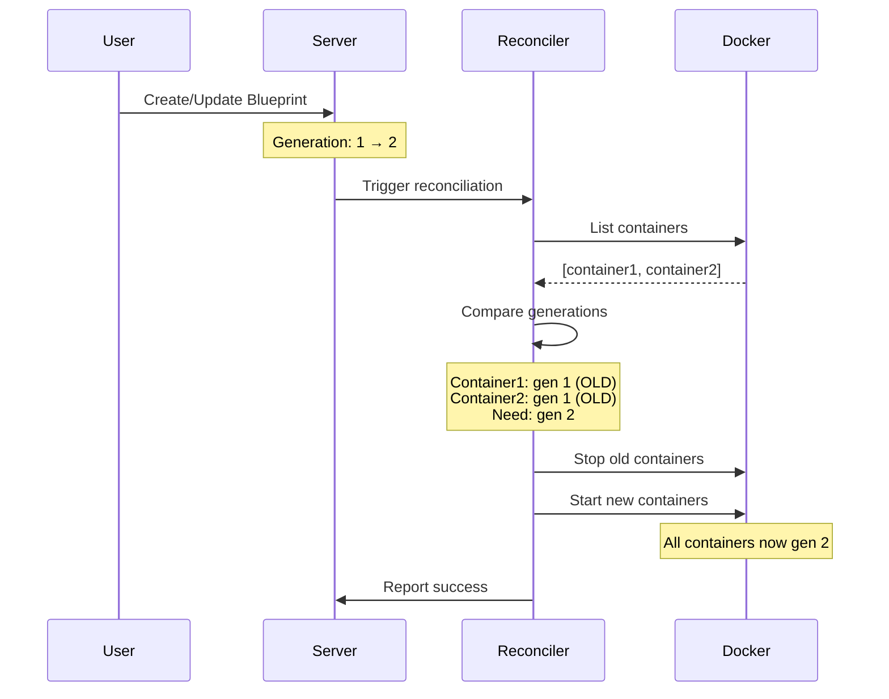

# Docker Reconciler

A ColonyOS executor that acts as a Kubernetes-style controller for managing Docker containers declaratively. It watches for blueprint changes and reconciles the desired state with actual running containers.

## Table of Contents

- [What is Docker Reconciler?](#what-is-docker-reconciler)
- [Core Concepts](#core-concepts)
- [Architecture](#architecture)
- [Blueprint Types](#blueprint-types)
- [Quick Start](#quick-start)
- [Configuration](#configuration)
- [Usage Examples](#usage-examples)
- [Container Management](#container-management)
- [Development](#development)
- [Troubleshooting](#troubleshooting)

## What is Docker Reconciler?

The Docker Reconciler is a **declarative container management system** for ColonyOS. Instead of manually starting and stopping containers, you declare what you want (the desired state), and the reconciler ensures it happens.

**Think of it like Kubernetes, but simpler:**
- You define a blueprint (like a Kubernetes deployment)
- The reconciler watches for changes
- Containers are automatically created, updated, or removed to match your blueprint

**Key Benefits:**
- **Declarative**: Describe what you want, not how to do it
- **Self-healing**: Reconciler constantly ensures actual state matches desired state
- **Version tracking**: Uses generation counters to detect and apply updates
- **Zero-downtime updates**: Containers are recreated when configuration changes

## Core Concepts

### 1. Blueprints

A **blueprint** is a JSON specification that describes what containers you want running. It's similar to a Kubernetes deployment or a docker-compose file.

Example - a simple web server blueprint:
```json
{
  "kind": "ExecutorDeployment",
  "metadata": {
    "name": "web-server"
  },
  "spec": {
    "image": "nginx:latest",
    "replicas": 3
  }
}
```

This tells the reconciler: "I want 3 nginx containers running, named web-server".

### 2. Reconciliation

**Reconciliation** is the process of making reality match your blueprint. The reconciler:

1. **Reads** your blueprint (desired state)
2. **Lists** currently running containers (actual state)
3. **Compares** them
4. **Takes action** to match desired state:
   - Start new containers if too few
   - Stop excess containers if too many
   - Recreate containers if configuration changed

This happens automatically whenever you create or update a blueprint.

### 3. Generation Tracking

Every time you update a blueprint, the **generation counter** increments. This allows the reconciler to detect which containers are outdated.

**Example:**
- You create a blueprint with `replicas: 3` → Generation 1
- 3 containers start, each labeled with `generation: 1`
- You update to `replicas: 5, env: PROD=true` → Generation 2
- Reconciler sees: 3 containers with generation 1 (outdated) + need 2 more
- It **recreates** the 3 old containers with new env vars
- It **creates** 2 new containers
- Result: 5 containers, all with generation 2

**Why this matters:** When you change environment variables, ports, or any configuration, containers are automatically recreated with the new settings.

### 4. Labels

Every managed container gets Docker labels:
- `colonies.deployment=<name>`: Links container to its blueprint
- `colonies.managed=true`: Marks it as managed by ColonyOS
- `colonies.generation=<number>`: Tracks the blueprint version

These labels allow the reconciler to:
- Find all containers belonging to a deployment
- Identify outdated containers that need updating
- Clean up containers when blueprints are deleted

## Architecture



### How It Works

**Step 1: User Creates Blueprint**
- You write a JSON specification describing your containers
- Submit it to ColonyOS: `colonies blueprint add --spec deployment.json`

**Step 2: Server Triggers Reconciliation**
- ColonyOS stores the blueprint with a generation number
- Creates a reconciliation process
- Assigns it to the Docker Reconciler executor

**Step 3: Reconciler Takes Action**
- Receives the blueprint
- Lists existing containers by label (`colonies.deployment=<name>`)
- Compares actual vs desired state

**Step 4: Container Management**
- Pulls container images if needed
- Checks generation labels to find outdated containers
- Recreates containers with wrong generation
- Scales up (starts new containers) or down (stops excess)

**Step 5: Status Reporting**
- Reconciler collects container states
- Reports back to ColonyOS server
- Server updates blueprint status

### Reconciliation Flow



## Blueprint Types

The reconciler supports two types of blueprints:

### ExecutorDeployment - Simple Scaling

**Use for:** Simple services that need multiple identical replicas

**Features:**
- Replica count (automatic scaling)
- Environment variables
- Port mappings
- Volume mounts
- Command/entrypoint override

**Example:** Run 5 identical nginx web servers
```json
{
  "kind": "ExecutorDeployment",
  "metadata": {
    "name": "nginx"
  },
  "spec": {
    "image": "nginx:latest",
    "replicas": 5,
    "env": {
      "NGINX_HOST": "example.com",
      "NGINX_PORT": "80"
    },
    "ports": [
      {
        "name": "http",
        "port": 80
      }
    ]
  }
}
```

**Result:** 5 containers named `nginx-0`, `nginx-1`, `nginx-2`, `nginx-3`, `nginx-4`

### DockerDeployment - Multi-Container Apps

**Use for:** Complex applications with multiple different services (like docker-compose)

**Features:**
- Named instances (not just replicas)
- Different images per instance
- Dependency ordering (`dependsOn`)
- Health checks
- Restart policies
- Resource limits

**Example:** Full-stack application with database, API, and frontend
```json
{
  "kind": "DockerDeployment",
  "metadata": {
    "name": "myapp"
  },
  "spec": {
    "instances": [
      {
        "name": "database",
        "image": "postgres:15",
        "environment": {
          "POSTGRES_PASSWORD": "secret"
        },
        "volumes": [
          {
            "type": "named",
            "name": "db-data",
            "mountPath": "/var/lib/postgresql/data"
          }
        ]
      },
      {
        "name": "api",
        "image": "myapp/api:latest",
        "dependsOn": ["database"],
        "environment": {
          "DB_HOST": "database"
        },
        "ports": [
          {
            "container": 8080,
            "host": 8080
          }
        ]
      },
      {
        "name": "web",
        "image": "myapp/web:latest",
        "dependsOn": ["api"],
        "ports": [
          {
            "container": 80,
            "host": 8000
          }
        ]
      }
    ]
  }
}
```

**Result:** 3 containers with names `database`, `api`, `web`

**Key Difference:** ExecutorDeployment creates multiple copies of the same container (scaling), while DockerDeployment creates different containers working together (composition).

## Quick Start

### Prerequisites

- Docker installed and running
- ColonyOS server running
- Colony private key

### Option 1: Docker Compose (Recommended)

```bash
# 1. Set your colony key
export COLONIES_COLONY_PRVKEY="your-colony-private-key"

# 2. Start reconciler
docker-compose up -d

# 3. Watch logs
docker-compose logs -f
```

### Option 2: Build and Run Locally

```bash
# 1. Build
make build

# 2. Configure
export COLONIES_SERVER_HOST="localhost"
export COLONIES_SERVER_PORT="50080"
export COLONIES_INSECURE="true"
export COLONIES_COLONY_NAME="dev"
export COLONIES_COLONY_PRVKEY="your-colony-private-key"
export COLONIES_EXECUTOR_NAME="docker-reconciler-1"

# 3. Start
./bin/docker-reconciler start --verbose
```

### First Deployment

```bash
# 1. Register blueprint type (one-time setup)
colonies blueprint definition add --spec - <<EOF
{
  "metadata": {
    "name": "executordeployments.compute.colonies.io"
  },
  "spec": {
    "group": "compute.colonies.io",
    "version": "v1",
    "names": {
      "kind": "ExecutorDeployment",
      "plural": "executordeployments"
    },
    "handler": {
      "executorType": "deployment-controller",
      "functionName": "reconcile"
    }
  }
}
EOF

# 2. Deploy nginx
colonies blueprint add --spec - <<EOF
{
  "kind": "ExecutorDeployment",
  "metadata": {
    "name": "nginx"
  },
  "spec": {
    "image": "nginx:latest",
    "replicas": 3
  }
}
EOF

# 3. Check containers
docker ps --filter "label=colonies.deployment=nginx"

# You should see 3 nginx containers running
```

## Configuration

### Environment Variables

| Variable | Description | Required | Default |
|----------|-------------|----------|---------|
| `COLONIES_SERVER_HOST` | ColonyOS server hostname | Yes | - |
| `COLONIES_SERVER_PORT` | ColonyOS server port | No | 443 |
| `COLONIES_INSECURE` | Use HTTP instead of HTTPS | No | false |
| `COLONIES_COLONY_NAME` | Colony name | Yes | - |
| `COLONIES_COLONY_PRVKEY` | Colony private key (for self-registration) | Yes* | - |
| `COLONIES_PRVKEY` | Executor private key (if pre-registered) | Yes* | - |
| `COLONIES_EXECUTOR_NAME` | Name of this executor | Yes | - |
| `COLONIES_EXECUTOR_TYPE` | Executor type | No | deployment-controller |
| `COLONIES_NODE_NAME` | Node name for executor registration | No | hostname |
| `COLONIES_NODE_LOCATION` | Node location/datacenter | No | default |

\* Either `COLONIES_COLONY_PRVKEY` (for self-registration) or `COLONIES_PRVKEY` (for pre-registered executor) is required

### Node Metadata

The reconciler automatically detects system information and registers it with ColonyOS:

**Detected automatically:**
- Hostname (or use `COLONIES_NODE_NAME`)
- Platform (linux, darwin, windows)
- Architecture (amd64, arm64)
- CPU cores (from `runtime.NumCPU()`)
- Total memory in MB (from `/proc/meminfo`)
- GPU count and details (via `nvidia-smi`)
- Capabilities: `["docker"]`

**Why this matters:** When you deploy executors as containers (ExecutorDeployment with `executorName`), they automatically register with this node information, creating a logical grouping of executors by physical host.

## Usage Examples

### Example 1: Simple Web Server

Deploy a web server with 3 replicas:

```bash
colonies blueprint add --spec - <<EOF
{
  "kind": "ExecutorDeployment",
  "metadata": {
    "name": "web"
  },
  "spec": {
    "image": "nginx:latest",
    "replicas": 3,
    "ports": [
      {
        "name": "http",
        "port": 80
      }
    ]
  }
}
EOF
```

**What happens:**
1. Reconciler pulls `nginx:latest` image
2. Creates 3 containers: `web-0`, `web-1`, `web-2`
3. Each listens on port 80
4. All labeled with `colonies.deployment=web`, `colonies.generation=1`

### Example 2: Scale Up/Down

```bash
# Scale up to 5 replicas
colonies blueprint update --spec - <<EOF
{
  "kind": "ExecutorDeployment",
  "metadata": {
    "name": "web"
  },
  "spec": {
    "image": "nginx:latest",
    "replicas": 5
  }
}
EOF

# Reconciler automatically:
# - Keeps web-0, web-1, web-2 running
# - Starts web-3 and web-4
# - Updates generation to 2

# Scale down to 2 replicas
colonies blueprint update --spec - <<EOF
{
  "kind": "ExecutorDeployment",
  "metadata": {
    "name": "web"
  },
  "spec": {
    "image": "nginx:latest",
    "replicas": 2
  }
}
EOF

# Reconciler automatically:
# - Stops and removes web-2, web-3, web-4
# - Keeps web-0, web-1 running
# - Updates generation to 3
```

### Example 3: Update Configuration

```bash
# Change environment variables
colonies blueprint update --spec - <<EOF
{
  "kind": "ExecutorDeployment",
  "metadata": {
    "name": "web"
  },
  "spec": {
    "image": "nginx:latest",
    "replicas": 2,
    "env": {
      "ENVIRONMENT": "production",
      "LOG_LEVEL": "debug"
    }
  }
}
EOF

# Reconciler automatically:
# - Detects generation mismatch (old containers have gen 3, blueprint is now gen 4)
# - Stops web-0 and web-1
# - Recreates web-0 and web-1 with new environment variables
# - All containers now have generation 4
```

**This is the power of generation tracking** - when you update the blueprint, containers are automatically recreated with the new configuration.

### Example 4: Multi-Container Application

```bash
colonies blueprint add --spec - <<EOF
{
  "kind": "DockerDeployment",
  "metadata": {
    "name": "blog"
  },
  "spec": {
    "instances": [
      {
        "name": "db",
        "image": "postgres:15",
        "environment": {
          "POSTGRES_PASSWORD": "secret",
          "POSTGRES_DB": "blog"
        },
        "volumes": [
          {
            "type": "named",
            "name": "blog-db",
            "mountPath": "/var/lib/postgresql/data"
          }
        ]
      },
      {
        "name": "app",
        "image": "ghost:latest",
        "dependsOn": ["db"],
        "environment": {
          "database__client": "postgres",
          "database__connection__host": "db",
          "database__connection__user": "postgres",
          "database__connection__password": "secret",
          "database__connection__database": "blog"
        },
        "ports": [
          {
            "container": 2368,
            "host": 8080
          }
        ]
      }
    ]
  }
}
EOF
```

**What happens:**
1. Creates `db` container (postgres)
2. Creates named volume `blog-db` for persistent data
3. Creates `app` container (Ghost blog)
4. Containers can reach each other by name (`db` hostname)
5. Blog accessible at `http://localhost:8080`

### Example 5: Deploy ColonyOS Executors

Deploy 5 docker executors that auto-register with the node:

```bash
colonies blueprint add --spec - <<EOF
{
  "kind": "ExecutorDeployment",
  "metadata": {
    "name": "docker-pool"
  },
  "spec": {
    "image": "colonyos/dockerexecutor:latest",
    "replicas": 5,
    "executorName": "docker-exec",
    "env": {
      "COLONIES_COLONY_PRVKEY": "your-colony-key"
    }
  }
}
EOF
```

**What happens:**
1. Reconciler generates 5 unique names: `docker-exec-a3f2e`, `docker-exec-b7k9m`, etc.
2. Creates 5 containers with unique executor names
3. Passes `COLONIES_NODE_NAME` and `COLONIES_NODE_LOCATION` to containers
4. Each container self-registers as an executor
5. All executors appear under the same node in ColonyOS

This is powerful for creating executor pools on specific hardware (e.g., GPU nodes).

## Container Management

### Container Labels

Every managed container has these Docker labels:

| Label | Value | Purpose |
|-------|-------|---------|
| `colonies.deployment` | Blueprint name | Find all containers for a deployment |
| `colonies.managed` | `true` | Identify ColonyOS-managed containers |
| `colonies.generation` | Generation number | Track blueprint version |

**Example:**
```bash
# Find all containers for "web" deployment
docker ps --filter "label=colonies.deployment=web"

# Find all managed containers
docker ps --filter "label=colonies.managed=true"

# Find containers with specific generation
docker inspect web-0 | grep colonies.generation
```

### Container Naming

**ExecutorDeployment without executorName:**
- Pattern: `<blueprint-name>-<index>`
- Example: `web-0`, `web-1`, `web-2`

**ExecutorDeployment with executorName:**
- Pattern: `<executor-name>-<unique-hash>`
- Example: `docker-exec-a3f2e`, `docker-exec-b7k9m`
- Hash ensures uniqueness across colony

**DockerDeployment:**
- Pattern: Instance name from spec
- Example: `database`, `api`, `web` (exactly as specified)

### Network Aliases

All containers from the same deployment share a network alias (the blueprint name). This enables service discovery:

```bash
# Deployment named "api" with 3 replicas
# Containers: api-0, api-1, api-2
# All respond to hostname "api"

# From another container:
curl http://api:8080
# Docker load-balances between api-0, api-1, api-2
```

### Manual Operations

```bash
# View container details
docker ps --filter "label=colonies.deployment=web"

# View logs
docker logs web-0

# Execute command in container
docker exec -it web-0 /bin/bash

# Clean up all managed containers
docker rm -f $(docker ps -aq --filter "label=colonies.managed=true")

# Clean up specific deployment
docker rm -f $(docker ps -aq --filter "label=colonies.deployment=web")
```

**Important:** If you manually remove containers, they won't restart automatically. The reconciler only acts when blueprints are created/updated. To trigger reconciliation, update the blueprint (even with no changes).

## Development

### Project Structure

```
docker-reconciler/
├── cmd/
│   └── main.go              # Entry point
├── pkg/
│   ├── executor/            # Process assignment & orchestration
│   │   └── executor.go      # - Handles reconciliation processes
│   │                        # - Detects node metadata
│   │                        # - Manages blueprint tracking
│   ├── reconciler/          # Core reconciliation logic
│   │   └── reconciler.go    # - Compares actual vs desired state
│   │                        # - Manages container lifecycle
│   │                        # - Interacts with Docker API
│   └── build/               # Build version info
├── internal/
│   └── cli/                 # CLI commands
├── examples/                # Example blueprints
├── docker-compose.yml       # Docker Compose setup
├── Dockerfile               # Container image
├── Makefile                 # Build automation
└── README.md                # This file
```

### Building

```bash
# Build binary
make build

# Build Docker container
make container

# Install to system
sudo make install

# Clean build artifacts
make clean
```

### Key Functions

**executor/executor.go:**
- `ServeForEver()`: Main loop - assigns processes from ColonyOS
- `handleReconcile()`: Processes reconciliation requests
- `detectNodeMetadata()`: Auto-detects system information
- `detectGPUs()`: Detects NVIDIA GPUs via nvidia-smi

**reconciler/reconciler.go:**
- `Reconcile()`: Routes to ExecutorDeployment or DockerDeployment handler
- `reconcileExecutorDeployment()`: Handles replica-based deployments
- `reconcileDockerDeployment()`: Handles multi-container deployments
- `findDirtyContainers()`: Identifies containers with outdated generation
- `startContainer()`: Creates and starts a container
- `stopAndRemoveContainer()`: Cleanup

## Troubleshooting

### Reconciler Won't Start

**Symptoms:**
- Container exits immediately
- Logs show connection errors

**Check:**
```bash
# View logs
docker-compose logs

# Common issues:
# 1. Missing COLONIES_COLONY_PRVKEY
# 2. Cannot connect to ColonyOS server
# 3. Docker socket not accessible
```

**Solution:**
```bash
# Verify environment
docker-compose config

# Test Docker access
docker ps

# Test ColonyOS connection
curl http://localhost:50080/api/v1/info
```

### Containers Not Created

**Symptoms:**
- Blueprint created but no containers appear
- Reconciliation process fails

**Check:**
```bash
# View reconciler logs
docker-compose logs -f

# Check process logs in ColonyOS
colonies process get --processid <id>

# Common issues:
# 1. Image not found
# 2. Docker socket permissions
# 3. Insufficient disk space
```

**Solution:**
```bash
# Pull image manually
docker pull nginx:latest

# Check disk space
df -h

# Verify Docker socket
ls -l /var/run/docker.sock
```

### Containers Not Updating

**Symptoms:**
- Updated blueprint but containers still have old configuration
- Environment variables not changing

**Check:**
```bash
# Verify generation labels
docker inspect web-0 | grep colonies.generation

# Get blueprint generation
colonies blueprint get --name web
```

**Why this happens:** Containers are only recreated when generation changes. If the process failed, containers may be out of sync.

**Solution:**
```bash
# Force recreation by removing containers
docker rm -f $(docker ps -aq --filter "label=colonies.deployment=web")

# Update blueprint (triggers reconciliation)
colonies blueprint update --spec deployment.json
```

### Connection Issues (Mac/Windows)

**Problem:** Reconciler can't connect to ColonyOS on `localhost`

**Why:** On Mac/Windows, Docker Desktop runs in a VM. Containers can't reach host's localhost.

**Solution:**
```bash
# Use special hostname
export COLONIES_SERVER_HOST=host.docker.internal

# Or in docker-compose.yml:
environment:
  COLONIES_SERVER_HOST: host.docker.internal
```

### GPU Detection Not Working

**Problem:** `GPU: 0` even though you have GPUs

**Solution:**
```bash
# Install nvidia-docker2 on host
sudo apt-get install nvidia-docker2

# Add GPU support to docker-compose.yml:
services:
  docker-reconciler:
    deploy:
      resources:
        reservations:
          devices:
            - driver: nvidia
              count: all
              capabilities: [gpu]
```

## Advanced Topics

### Privileged Containers

Some containers need elevated privileges (e.g., Docker-in-Docker):

```json
{
  "kind": "ExecutorDeployment",
  "spec": {
    "image": "docker:dind",
    "privileged": true,
    "volumes": [
      {
        "host": "/var/run/docker.sock",
        "container": "/var/run/docker.sock"
      }
    ]
  }
}
```

### Resource Limits

For DockerDeployment, specify CPU and memory limits:

```json
{
  "name": "worker",
  "image": "myapp/worker:latest",
  "resources": {
    "cpus": "2.0",
    "memory": "4096"
  }
}
```

### Custom Commands

Override container command/entrypoint:

```json
{
  "kind": "ExecutorDeployment",
  "spec": {
    "image": "ubuntu:latest",
    "command": ["/bin/bash"],
    "args": ["-c", "sleep infinity"]
  }
}
```

## Security Considerations

**Important Security Notes:**

1. **Docker Socket Access**: The reconciler mounts `/var/run/docker.sock` to manage containers. This grants significant privileges - essentially root access to the host. Only run in trusted environments.

2. **Privileged Containers**: Use `privileged: true` only when absolutely necessary. These containers can modify the host system.

3. **Secrets Management**: Never put passwords or API keys in blueprint specs. Use environment variables or proper secret management:
   ```bash
   # Bad: Secrets in blueprint
   "env": {
     "DB_PASSWORD": "mysecret123"
   }

   # Good: Reference from environment
   export DB_PASSWORD="mysecret123"
   # Pass via reconciler environment, not blueprint
   ```

4. **TLS in Production**: Always use TLS:
   ```bash
   COLONIES_INSECURE=false  # Use HTTPS
   COLONIES_SERVER_PORT=443
   ```

5. **Network Isolation**: Consider using custom Docker networks to isolate deployments from each other.

## License

See main ColonyOS repository for license information.

## Contributing

This executor is part of the ColonyOS ecosystem. Contributions welcome!

1. Follow ColonyOS contribution guidelines
2. Test locally before submitting PRs
3. Update documentation for new features
4. Add examples for complex features

## Support

- **Documentation**: This README
- **Issues**: [ColonyOS GitHub Issues](https://github.com/colonyos/colonies/issues)
- **Examples**: See `examples/` directory
