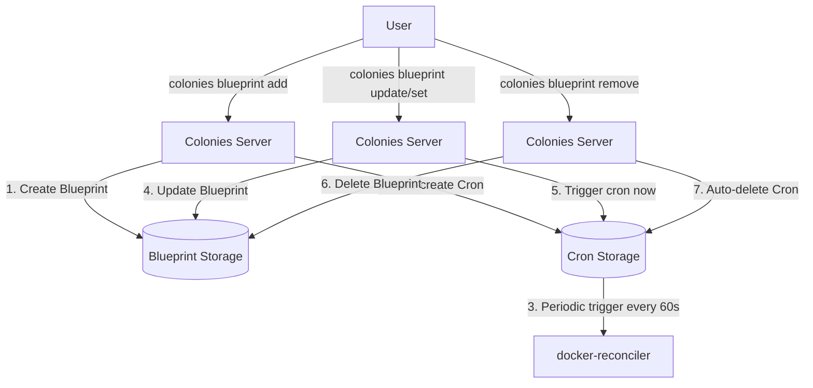

# Blueprint Cron Lifecycle Design

## Overview

This design document describes the automatic lifecycle management of reconciliation crons tied to blueprints. When a blueprint is created, a corresponding cron is automatically created to drive periodic self-healing and enable immediate reconciliation triggers.

## Problem Statement

Currently, reconciliation requires:
1. Manual cron creation for each blueprint
2. Manual mapping between blueprints and crons
3. Manual cron cleanup when blueprints are deleted

This creates operational overhead and potential for errors (orphaned crons, missing crons, etc.).

## Solution

Automatically manage reconciliation cron lifecycle as part of blueprint lifecycle:
- **Blueprint creation** → Auto-create reconciliation cron
- **Blueprint updates** (`update` or `set` commands) → Trigger immediate reconciliation via cron
- **Blueprint deletion** → Auto-delete reconciliation cron

## Architecture

### High-Level Flow



### Components

**1. Blueprint with Cron Reference**
```go
type Blueprint struct {
    Metadata struct {
        Name        string
        Namespace   string
        Generation  int64
        Annotations map[string]string  // Stores cron reference
    }
    Kind string
    Spec map[string]interface{}
}
```

**2. Auto-Created Cron**
```go
type Cron struct {
    Name                    string  // "reconcile-{blueprintName}"
    Interval                int     // 60 seconds
    WaitForPrevProcessGraph bool    // true - ensures sequential execution
    WorkflowSpec            string  // Single-process workflow
}
```

**3. Reconciliation Workflow**
```json
{
  "functionspecs": [{
    "funcname": "reconcile-blueprint",
    "executortype": "docker-reconciler",
    "args": {
      "blueprintName": "c1-database"
    }
  }]
}
```

## Blueprint-Cron Lifecycle

### 1. Blueprint Creation

**User action:**
```bash
colonies blueprint add --file c1-database.json
```

**Server-side flow:**
```go
func AddBlueprint(blueprint *core.Blueprint, initiatorKey string) (*core.Blueprint, error) {
    // 1. Validate and store blueprint
    blueprint.Metadata.Generation = 1
    err := db.AddBlueprint(blueprint)
    if err != nil {
        return nil, err
    }

    // 2. Auto-create reconciliation cron
    cronName := "reconcile-" + blueprint.Metadata.Name
    workflowSpec := createReconcileWorkflow(blueprint)

    cron := &core.Cron{
        ColonyName:              blueprint.Metadata.Namespace,
        Name:                    cronName,
        Interval:                60,  // 60 seconds
        WaitForPrevProcessGraph: true,
        WorkflowSpec:            workflowSpec,
        InitiatorID:             initiatorID,
    }

    addedCron, err := controller.AddCron(cron)
    if err != nil {
        // Rollback: remove blueprint if cron creation fails
        db.RemoveBlueprintByID(blueprint.ID)
        return nil, fmt.Errorf("failed to create reconciliation cron: %w", err)
    }

    // 3. Store cron reference in blueprint annotations
    if blueprint.Metadata.Annotations == nil {
        blueprint.Metadata.Annotations = make(map[string]string)
    }
    blueprint.Metadata.Annotations["reconciliation.cron.id"] = addedCron.ID
    blueprint.Metadata.Annotations["reconciliation.cron.name"] = addedCron.Name

    err = db.UpdateBlueprint(blueprint)
    if err != nil {
        // Rollback: remove cron if annotation update fails
        db.RemoveCronByID(addedCron.ID)
        db.RemoveBlueprintByID(blueprint.ID)
        return nil, err
    }

    log.WithFields(log.Fields{
        "BlueprintName": blueprint.Metadata.Name,
        "CronName":      cronName,
        "CronID":        addedCron.ID,
    }).Info("Auto-created reconciliation cron for blueprint")

    return blueprint, nil
}
```

**Helper function:**
```go
func createReconcileWorkflow(blueprint *core.Blueprint) string {
    workflowSpec := &core.WorkflowSpec{
        FunctionSpecs: []core.FunctionSpec{
            {
                FuncName:     "reconcile-blueprint",
                ExecutorType: "docker-reconciler",
                Args: map[string]interface{}{
                    "blueprintName": blueprint.Metadata.Name,
                },
                Conditions: core.Conditions{
                    ColonyName: blueprint.Metadata.Namespace,
                },
            },
        },
    }

    workflowJSON, _ := json.Marshal(workflowSpec)
    return string(workflowJSON)
}
```

### 2. Blueprint Update

**User actions:**
```bash
# Option A: Update from file
colonies blueprint update --file c1-database.json

# Option B: Set specific field
colonies blueprint set --name c1-database --key replicas --value 5
```

**Both commands eventually call `UpdateBlueprint()` on the server:**
- `colonies blueprint update` - parses file and calls `client.UpdateBlueprint()`
- `colonies blueprint set` - fetches blueprint, modifies field, calls `client.UpdateBlueprint()`

**Server-side flow:**
```go
func UpdateBlueprint(blueprint *core.Blueprint, initiatorKey string) (*core.Blueprint, error) {
    // 1. Get existing blueprint
    existing, err := db.GetBlueprintByName(blueprint.Metadata.Namespace, blueprint.Metadata.Name)
    if err != nil {
        return nil, err
    }

    // 2. Increment generation
    blueprint.Metadata.Generation = existing.Metadata.Generation + 1

    // 3. Store blueprint history (for rollback/audit)
    history := &core.BlueprintHistory{
        BlueprintID: existing.ID,
        Generation:  existing.Metadata.Generation,
        Spec:        existing.Spec,
        Timestamp:   time.Now(),
    }
    db.AddBlueprintHistory(history)

    // 4. Update blueprint
    err = db.UpdateBlueprint(blueprint)
    if err != nil {
        return nil, err
    }

    // 5. Trigger immediate reconciliation
    cronName := existing.Metadata.Annotations["reconciliation.cron.name"]
    if cronName != "" {
        cron, err := db.GetCronByName(blueprint.Metadata.Namespace, cronName)
        if err == nil {
            log.WithFields(log.Fields{
                "BlueprintName": blueprint.Metadata.Name,
                "Generation":    blueprint.Metadata.Generation,
                "CronName":      cronName,
            }).Info("Triggering immediate reconciliation after blueprint update")

            controller.RunCron(cron.ID)
        } else {
            log.WithFields(log.Fields{
                "Error":         err,
                "BlueprintName": blueprint.Metadata.Name,
                "CronName":      cronName,
            }).Warn("Failed to trigger reconciliation cron - cron not found")
        }
    }

    return blueprint, nil
}
```

### 3. Blueprint Deletion

**User action:**
```bash
colonies blueprint remove --name c1-database
```

**Server-side flow:**
```go
func RemoveBlueprint(namespace, name string, initiatorKey string) error {
    // 1. Get blueprint
    blueprint, err := db.GetBlueprintByName(namespace, name)
    if err != nil {
        return err
    }

    // 2. Get cron reference
    cronName := blueprint.Metadata.Annotations["reconciliation.cron.name"]

    // 3. Remove blueprint first
    err = db.RemoveBlueprintByName(namespace, name)
    if err != nil {
        return err
    }

    // 4. Remove associated cron (best-effort, don't fail if cron missing)
    if cronName != "" {
        err = db.RemoveCronByName(namespace, cronName)
        if err != nil {
            log.WithFields(log.Fields{
                "Error":         err,
                "BlueprintName": name,
                "CronName":      cronName,
            }).Warn("Failed to remove reconciliation cron (may already be deleted)")
        } else {
            log.WithFields(log.Fields{
                "BlueprintName": name,
                "CronName":      cronName,
            }).Info("Auto-removed reconciliation cron for deleted blueprint")
        }
    }

    // 5. Remove blueprint history (optional - may want to keep for audit)
    db.RemoveBlueprintHistory(blueprint.ID)

    return nil
}
```

### 4. Manual Reconciliation Trigger

**User action:**
```bash
colonies blueprint reconcile --name c1-database
```

**New CLI command:**
```go
var reconcileBlueprintCmd = &cobra.Command{
    Use:   "reconcile",
    Short: "Trigger immediate reconciliation of a blueprint",
    Long:  "Trigger immediate reconciliation of a blueprint by running its associated cron",
    Run: func(cmd *cobra.Command, args []string) {
        client := setup()

        if BlueprintName == "" {
            CheckError(errors.New("Blueprint name not specified"))
        }

        // Get blueprint
        blueprint, err := client.GetBlueprintByName(ColonyName, BlueprintName, PrvKey)
        CheckError(err)

        // Get cron from blueprint annotations
        cronName := blueprint.Metadata.Annotations["reconciliation.cron.name"]
        if cronName == "" {
            CheckError(errors.New("Blueprint has no associated reconciliation cron"))
        }

        // Get cron
        cron, err := client.GetCronByName(ColonyName, cronName, PrvKey)
        CheckError(err)

        // Run cron
        _, err = client.RunCron(cron.ID, PrvKey)
        CheckError(err)

        log.WithFields(log.Fields{
            "BlueprintName": BlueprintName,
            "CronName":      cronName,
        }).Info("Triggered immediate reconciliation")
    },
}
```

## Reconciler Implementation

**New function handler in docker-reconciler:**

```go
func (e *Executor) dispatchProcess(process *core.Process) {
    switch process.FunctionSpec.FuncName {
    case "reconcile":
        e.handleReconcile(process)  // Existing - blueprint embedded in process
    case "reconcile-blueprint":
        e.handleReconcileBlueprint(process)  // New - fetch blueprint from server
    default:
        e.handleUnsupportedFunction(process)
    }
}

func (e *Executor) handleReconcileBlueprint(process *core.Process) {
    log.WithFields(log.Fields{"ProcessID": process.ID}).Info("Handling blueprint reconciliation")

    // Extract blueprint name from args
    blueprintName, ok := process.FunctionSpec.Args["blueprintName"].(string)
    if !ok {
        e.failProcess(process, "Blueprint name not found in process args")
        return
    }

    // Fetch current blueprint from server
    blueprint, err := e.client.GetBlueprintByName(e.colonyName, blueprintName, e.colonyPrvKey)
    if err != nil {
        e.failProcess(process, "Failed to fetch blueprint: " + err.Error())
        return
    }

    log.WithFields(log.Fields{
        "BlueprintName": blueprint.Metadata.Name,
        "Generation":    blueprint.Metadata.Generation,
    }).Info("Fetched blueprint from server")

    // Check if reconciliation needed
    needsReconciliation, reason := e.checkReconciliationNeeded(blueprint)
    if !needsReconciliation {
        log.WithFields(log.Fields{
            "BlueprintName": blueprint.Metadata.Name,
        }).Info("Blueprint already at desired state")
        e.client.Close(process.ID, e.executorPrvKey)
        return
    }

    log.WithFields(log.Fields{
        "BlueprintName": blueprint.Metadata.Name,
        "Reason":        reason,
        "Generation":    blueprint.Metadata.Generation,
    }).Info("Reconciliation needed")

    // Perform reconciliation
    if err := e.reconciler.Reconcile(process, blueprint); err != nil {
        e.failProcess(process, "Reconciliation failed: " + err.Error())
        return
    }

    // Collect status after successful reconciliation
    status, err := e.reconciler.CollectStatus(blueprint)
    if err != nil {
        log.WithFields(log.Fields{"Error": err}).Warn("Failed to collect status")
        e.client.Close(process.ID, e.executorPrvKey)
        return
    }

    // Close with status output
    output := []interface{}{
        map[string]interface{}{
            "status": status,
        },
    }

    if err := e.client.CloseWithOutput(process.ID, output, e.executorPrvKey); err != nil {
        log.WithFields(log.Fields{"Error": err}).Error("Failed to close process with output")
    } else {
        log.WithFields(log.Fields{
            "BlueprintName":   blueprint.Metadata.Name,
            "Generation":      blueprint.Metadata.Generation,
            "RunningInstances": status["runningInstances"],
        }).Info("Reconciliation completed successfully")
    }
}
```

## High Availability

**Multiple reconciler executors can run:**
- All reconciler executors poll for `reconcile-blueprint` processes
- Any available executor can pick up the work
- Sequential execution guaranteed by `WaitForPrevProcessGraph=true` in cron

**Cron trigger loop:**
- Server-side cron controller uses leader election
- Only one server triggers crons (if multiple servers)
- `TriggerCrons()` runs every 60s on leader

## User Workflow

### Complete Example

```bash
# 1. Create blueprint (cron auto-created)
colonies blueprint add --file c1-database.json
# Output:
# Blueprint created: c1-database
# Auto-created reconciliation cron: reconcile-c1-database
# Self-healing interval: 60s

# 2. View blueprint (shows cron reference)
colonies blueprint get --name c1-database
# Output shows:
# metadata:
#   annotations:
#     reconciliation.cron.id: "abc123"
#     reconciliation.cron.name: "reconcile-c1-database"

# 3. Update blueprint (triggers immediate reconciliation)
# Option A: Update from file
colonies blueprint update --file c1-database.json
# Output:
# Blueprint updated: c1-database (generation 1 → 2)
# Triggering immediate reconciliation...

# Option B: Set specific field (also triggers reconciliation)
colonies blueprint set --name c1-database --key replicas --value 5
# Output:
# Blueprint field updated: c1-database.replicas = 5 (generation 2 → 3)
# Triggering immediate reconciliation...

# 4. Manual trigger (if needed)
colonies blueprint reconcile --name c1-database
# Output:
# Triggered reconciliation for c1-database

# 5. Monitor reconciliation
colonies process ls --label "reconcile:c1-database"

# 6. Delete blueprint (cron auto-deleted)
colonies blueprint remove --name c1-database
# Output:
# Blueprint deleted: c1-database
# Auto-removed reconciliation cron: reconcile-c1-database
```

## Migration Strategy

### Phase 1: Implement Auto-Creation (Non-Breaking)

- Add cron auto-creation logic to `AddBlueprint()`
- Add cron auto-deletion logic to `RemoveBlueprint()`
- Add immediate trigger to `UpdateBlueprint()`
- Existing blueprints without crons continue to work

### Phase 2: Migrate Existing Blueprints

**Migration command:**
```bash
colonies blueprint migrate-crons
```

**Implementation:**
```go
func MigrateBlueprintCrons() error {
    blueprints, err := db.GetBlueprints()
    if err != nil {
        return err
    }

    for _, blueprint := range blueprints {
        // Check if cron already exists
        cronName := "reconcile-" + blueprint.Metadata.Name
        _, err := db.GetCronByName(blueprint.Metadata.Namespace, cronName)
        if err == nil {
            log.Info("Cron already exists for blueprint:", blueprint.Metadata.Name)
            continue
        }

        // Create cron for existing blueprint
        workflowSpec := createReconcileWorkflow(blueprint)
        cron := &core.Cron{
            ColonyName:              blueprint.Metadata.Namespace,
            Name:                    cronName,
            Interval:                60,
            WaitForPrevProcessGraph: true,
            WorkflowSpec:            workflowSpec,
        }

        addedCron, err := controller.AddCron(cron)
        if err != nil {
            log.Error("Failed to create cron for blueprint:", blueprint.Metadata.Name, err)
            continue
        }

        // Update blueprint annotations
        if blueprint.Metadata.Annotations == nil {
            blueprint.Metadata.Annotations = make(map[string]string)
        }
        blueprint.Metadata.Annotations["reconciliation.cron.id"] = addedCron.ID
        blueprint.Metadata.Annotations["reconciliation.cron.name"] = addedCron.Name
        db.UpdateBlueprint(blueprint)

        log.Info("Created cron for existing blueprint:", blueprint.Metadata.Name)
    }

    return nil
}
```

## Error Handling

### Cron Creation Failure

**During blueprint creation:**
- Rollback: Delete blueprint if cron creation fails
- Return error to user
- User can retry

### Cron Deletion Failure

**During blueprint deletion:**
- Log warning but don't fail blueprint deletion
- Blueprint is primary resource
- Orphaned crons can be cleaned up later

### Cron Not Found

**During blueprint update:**
- Log warning
- Continue with blueprint update
- Don't trigger reconciliation
- User can manually recreate cron

## Security Considerations

**Cron permissions:**
- Cron inherits initiator from blueprint creator
- Only blueprint creator/owner can trigger cron
- Colony owner can delete/modify crons

**Blueprint-cron binding:**
- Cron name includes blueprint name (prevents collisions)
- Annotation provides explicit binding
- Server validates cron ownership on trigger

## Benefits

✅ **Declarative** - Just manage blueprints, crons managed automatically
✅ **Consistent** - No manual cron management errors
✅ **Clean lifecycle** - No orphaned crons
✅ **Immediate reconciliation** - `blueprint update` triggers reconciliation
✅ **Periodic self-healing** - Automatic every 60s
✅ **Sequential execution** - `WaitForPrevProcessGraph` prevents conflicts
✅ **HA support** - Multiple reconciler executors
✅ **Server-driven** - No executor-side self-healing loops

## Future Enhancements

1. **Configurable intervals** - Allow blueprint to specify reconciliation interval
2. **Pause reconciliation** - Annotation to disable cron temporarily
3. **Reconciliation policies** - Different strategies (immediate, lazy, etc.)
4. **Rollback** - Use blueprint history to rollback to previous generation
5. **Dry-run** - Preview reconciliation changes before applying
