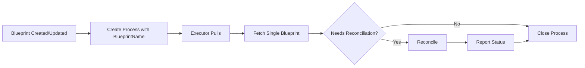

# Cron-Based Reconciliation Architecture

## Overview

The docker-reconciler is now **completely stateless** and driven by server-side crons. There are NO background loops, NO in-memory state tracking, and NO startup reconciliation. Everything is event-driven from the server.

## How It Works

### 1. Consolidated Cron Architecture

The system uses **consolidated crons** - one cron per Kind (executor type), not per blueprint. This is critical for scalability:

```
colonies blueprint add    →  Server creates cron: "reconcile-<Kind>" (if first of Kind)
                          →  Server submits immediate reconciliation process
colonies blueprint update →  Server submits immediate reconciliation process
colonies blueprint remove →  Server deletes cron only if last blueprint of Kind
```

**Key Benefit**: 100 blueprints = 1 cron (not 100 crons!)

### 2. Cron Configuration

Each Kind (e.g., ExecutorDeployment, DockerDeployment) gets one consolidated cron:
- **Name**: `reconcile-<Kind>` (e.g., "reconcile-ExecutorDeployment")
- **Interval**: 60 seconds (periodic self-healing)
- **WaitForPrevProcessGraph**: `true` (prevents concurrent reconciliation)
- **WorkflowSpec**: Single function that fetches ALL blueprints of that Kind and reconciles them in parallel

### 3. Reconciliation Modes

The reconciler supports two modes:

#### Periodic Consolidated Reconciliation (Cron-triggered)


#### Immediate Single-Blueprint Reconciliation (On create/update)


**Key Points:**
- **Parallel execution**: When cron triggers, all blueprints of that Kind are reconciled in parallel
- **Scalable**: 100 blueprints with 60-second interval = 1 process every 60 seconds (not 100!)
- Executor **fetches** blueprints from server (not embedded in process)
- Always operates on latest blueprint state
- Status reported back to update blueprint

## Architecture Benefits

### ✅ Stateless Executors
- No managed resources map
- No background goroutines
- No startup reconciliation
- Clean restarts without drift

### ✅ High Availability
- Run multiple reconciler executors safely
- Sequential execution guaranteed by `WaitForPrevProcessGraph`
- No "war between reconcilers"

### ✅ Event-Driven
- Immediate reconciliation on blueprint changes
- Periodic self-healing every 60 seconds
- Manual trigger via CLI: `colonies blueprint reconcile`

### ✅ Always Current
- Fetches latest blueprint state from server
- No stale data issues
- GitOps friendly (git updates → server → reconciliation)

### ✅ Simple & Correct
- One function: `reconcile`
- One purpose: fetch blueprint and reconcile
- Idempotent and safe to retry

## Code Structure

### Removed (No Longer Needed)
- ❌ `self_healing.go` - No background loops
- ❌ `startup_reconciliation.go` - No startup checks
- ❌ `managedResources map` - No state tracking
- ❌ `reconcile-blueprint` function - Unified to just `reconcile`

### Current Files
- ✅ `executor.go` - Registers `reconcile` function
- ✅ `reconciliation_loop.go` - Blocks waiting for processes
- ✅ `process_handler.go` - Fetches blueprint and reconciles
- ✅ `reconciliation_helpers.go` - Status checking utilities

## Example: Creating First Blueprint of a Kind

```bash
# User creates first ExecutorDeployment blueprint
colonies blueprint add --spec deployment.json

# Server automatically:
# 1. Stores blueprint (generation 1)
# 2. Creates consolidated cron: "reconcile-ExecutorDeployment" (first of Kind)
# 3. Submits immediate reconciliation process

# Immediate process created:
{
  "funcName": "reconcile",
  "kwargs": {
    "blueprintName": "deployment"  // Single blueprint
  }
}

# Executor:
# 1. Pulls process from queue
# 2. Extracts blueprintName from kwargs
# 3. Fetches blueprint from server
# 4. Lists Docker containers
# 5. Compares and reconciles
# 6. Reports status back
```

## Example: Creating Additional Blueprints

```bash
# User creates second ExecutorDeployment blueprint
colonies blueprint add --spec deployment2.json

# Server automatically:
# 1. Stores blueprint (generation 1)
# 2. Cron "reconcile-ExecutorDeployment" already exists - reuses it
# 3. Submits immediate reconciliation process for just this blueprint

# No new cron created - scales to hundreds of blueprints!
```

## Example: Periodic Reconciliation (Cron-triggered)

```bash
# Every 60 seconds, cron fires:
{
  "funcName": "reconcile",
  "kwargs": {
    "kind": "ExecutorDeployment"  // ALL blueprints of this Kind
  }
}

# Executor:
# 1. Pulls process
# 2. Fetches ALL ExecutorDeployment blueprints from server
# 3. Reconciles each blueprint in PARALLEL
# 4. Aggregates results
# 5. Closes process with combined status
```

## Example: Updating a Blueprint

```bash
# User updates blueprint
colonies blueprint update --spec deployment.json

# Server automatically:
# 1. Updates blueprint (generation 2)
# 2. Submits immediate reconciliation process for this specific blueprint

# Executor fetches gen 2 blueprint and updates containers
```

## Example: Deleted Container (Self-Healing)

```bash
# User manually deletes a container
docker rm -f web-0

# Within 60 seconds:
# - Cron fires (periodic interval)
# - Process created
# - Executor reconciles
# - Missing container recreated
```

## Timing

| Event | Response Time |
|-------|--------------|
| Blueprint create/update | Immediate (cron triggered) |
| Container crash/deletion | Within 60 seconds (next cron run) |
| Manual trigger | Immediate (`colonies blueprint reconcile`) |
| Periodic check | Every 60 seconds |

## Efficiency

**Optimization: Early Exit**

The executor checks if reconciliation is actually needed:

```go
needsReconciliation, reason := e.checkReconciliationNeeded(blueprint)
if !needsReconciliation {
    // No work needed - close process immediately
    return
}
```

Checks:
1. Replica count mismatch?
2. Old generation containers?

If everything matches, the process completes without any Docker operations.

## Troubleshooting

### Check Cron Status
```bash
# List all crons
colonies cron ls

# Get specific cron details
colonies cron get --cronid <id>

# View recent processes
colonies process psw --count 10
```

### Manual Trigger
```bash
# Trigger reconciliation immediately
colonies blueprint reconcile --name <blueprint-name>

# Or trigger the cron directly
colonies cron run --cronid <cron-id>
```

### Debug Process Failures
```bash
# View failed processes
colonies process psf --count 5

# Get specific process details
colonies process get --processid <id>
```

## Comparison with Old Architecture

| Feature | Old (Per-Blueprint Cron) | New (Consolidated Cron) |
|---------|------------------------|-------------------------|
| Cron count | 1 cron per blueprint | 1 cron per Kind |
| Scalability | 100 blueprints = 100 crons | 100 blueprints = 1 cron |
| Processes per minute | N blueprints × 1 process | 1 process (parallel) |
| State tracking | None (stateless) | None (stateless) |
| HA support | Safe - sequential execution | Safe - parallel within process |
| Immediate updates | Trigger cron | Submit single-blueprint process |

## Scalability

The consolidated cron architecture provides excellent scalability:

| Blueprints | Old: Processes/minute | New: Processes/minute | Improvement |
|------------|----------------------|----------------------|-------------|
| 10 | 10 | 1 | 10x |
| 100 | 100 | 1 | 100x |
| 1000 | 1000 | 1 | 1000x |

Within each cron-triggered process, all blueprints are reconciled **in parallel**, so the wall-clock time remains constant regardless of blueprint count.

## Summary

The consolidated cron architecture is **simpler, more scalable, and easier to operate**. Key improvements:
- **One cron per Kind** instead of per blueprint
- **Parallel reconciliation** of all blueprints within a single process
- **Immediate single-blueprint reconciliation** for create/update operations
- **Automatic cleanup** when blueprints are deleted

All intelligence lives server-side, and executors are pure reactive workers. This follows the best practices for distributed systems: stateless, idempotent, and server-driven.
