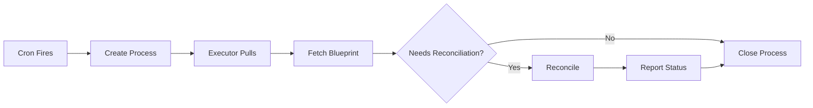

# Cron-Based Reconciliation Architecture

## Overview

The docker-reconciler is now **completely stateless** and driven by server-side crons. There are NO background loops, NO in-memory state tracking, and NO startup reconciliation. Everything is event-driven from the server.

## How It Works

### 1. Blueprint Lifecycle = Cron Lifecycle

When you create/update/delete a blueprint, the server automatically manages a corresponding cron:

```
colonies blueprint add    →  Server creates cron: "reconcile-<blueprint-name>"
colonies blueprint update →  Server triggers cron immediately
colonies blueprint remove →  Server deletes cron
```

### 2. Cron Configuration

Each blueprint gets one cron with these settings:
- **Name**: `reconcile-<blueprintName>`
- **Interval**: 60 seconds (periodic self-healing)
- **WaitForPrevProcessGraph**: `true` (prevents concurrent reconciliation)
- **WorkflowSpec**: Single function that fetches and reconciles the blueprint

### 3. Reconciliation Process



**Key Points:**
- Executor **fetches** blueprint from server (not embedded in process)
- Early exit if no work needed (optimization)
- Always operates on latest blueprint state
- Status reported back to update blueprint

## Architecture Benefits

### ✅ Stateless Executors
- No managed resources map
- No background goroutines
- No startup reconciliation
- Clean restarts without drift

### ✅ High Availability
- Run multiple reconciler executors safely
- Sequential execution guaranteed by `WaitForPrevProcessGraph`
- No "war between reconcilers"

### ✅ Event-Driven
- Immediate reconciliation on blueprint changes
- Periodic self-healing every 60 seconds
- Manual trigger via CLI: `colonies blueprint reconcile`

### ✅ Always Current
- Fetches latest blueprint state from server
- No stale data issues
- GitOps friendly (git updates → server → reconciliation)

### ✅ Simple & Correct
- One function: `reconcile`
- One purpose: fetch blueprint and reconcile
- Idempotent and safe to retry

## Code Structure

### Removed (No Longer Needed)
- ❌ `self_healing.go` - No background loops
- ❌ `startup_reconciliation.go` - No startup checks
- ❌ `managedResources map` - No state tracking
- ❌ `reconcile-blueprint` function - Unified to just `reconcile`

### Current Files
- ✅ `executor.go` - Registers `reconcile` function
- ✅ `reconciliation_loop.go` - Blocks waiting for processes
- ✅ `process_handler.go` - Fetches blueprint and reconciles
- ✅ `reconciliation_helpers.go` - Status checking utilities

## Example: Creating a Blueprint

```bash
# User creates blueprint
colonies blueprint add --spec deployment.json

# Server automatically:
# 1. Stores blueprint (generation 1)
# 2. Creates cron: "reconcile-deployment"
# 3. Triggers cron immediately

# Cron creates process:
{
  "funcName": "reconcile",
  "kwargs": {
    "blueprintName": "deployment"
  }
}

# Executor:
# 1. Pulls process from queue
# 2. Extracts blueprintName from kwargs
# 3. Fetches blueprint from server
# 4. Lists Docker containers
# 5. Compares and reconciles
# 6. Reports status back
```

## Example: Updating a Blueprint

```bash
# User updates blueprint
colonies blueprint update --spec deployment.json

# Server automatically:
# 1. Updates blueprint (generation 2)
# 2. Triggers existing cron immediately

# Same reconciliation process as above
# Executor fetches gen 2 blueprint and updates containers
```

## Example: Deleted Container (Self-Healing)

```bash
# User manually deletes a container
docker rm -f web-0

# Within 60 seconds:
# - Cron fires (periodic interval)
# - Process created
# - Executor reconciles
# - Missing container recreated
```

## Timing

| Event | Response Time |
|-------|--------------|
| Blueprint create/update | Immediate (cron triggered) |
| Container crash/deletion | Within 60 seconds (next cron run) |
| Manual trigger | Immediate (`colonies blueprint reconcile`) |
| Periodic check | Every 60 seconds |

## Efficiency

**Optimization: Early Exit**

The executor checks if reconciliation is actually needed:

```go
needsReconciliation, reason := e.checkReconciliationNeeded(blueprint)
if !needsReconciliation {
    // No work needed - close process immediately
    return
}
```

Checks:
1. Replica count mismatch?
2. Old generation containers?

If everything matches, the process completes without any Docker operations.

## Troubleshooting

### Check Cron Status
```bash
# List all crons
colonies cron ls

# Get specific cron details
colonies cron get --cronid <id>

# View recent processes
colonies process psw --count 10
```

### Manual Trigger
```bash
# Trigger reconciliation immediately
colonies blueprint reconcile --name <blueprint-name>

# Or trigger the cron directly
colonies cron run --cronid <cron-id>
```

### Debug Process Failures
```bash
# View failed processes
colonies process psf --count 5

# Get specific process details
colonies process get --processid <id>
```

## Comparison with Old Architecture

| Feature | Old (Background Loops) | New (Cron-Based) |
|---------|----------------------|------------------|
| State tracking | In-memory map | None (stateless) |
| Reconciliation trigger | Background ticker + processes | Server crons only |
| Startup behavior | Scan all blueprints | None - wait for cron |
| HA support | Conflicts between executors | Safe - sequential execution |
| Blueprint updates | Two functions | One function |
| Code complexity | ~500 lines | ~200 lines |

## Summary

The cron-based architecture is **simpler, more correct, and easier to operate**. All intelligence lives server-side, and executors are pure reactive workers. This follows the best practices for distributed systems: stateless, idempotent, and server-driven.
