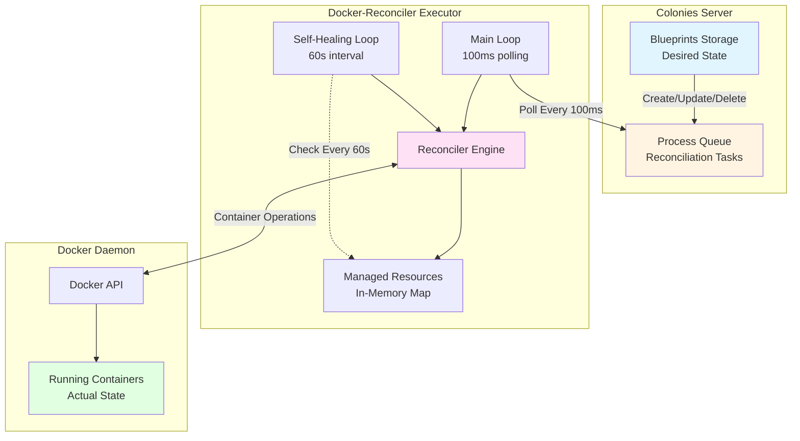
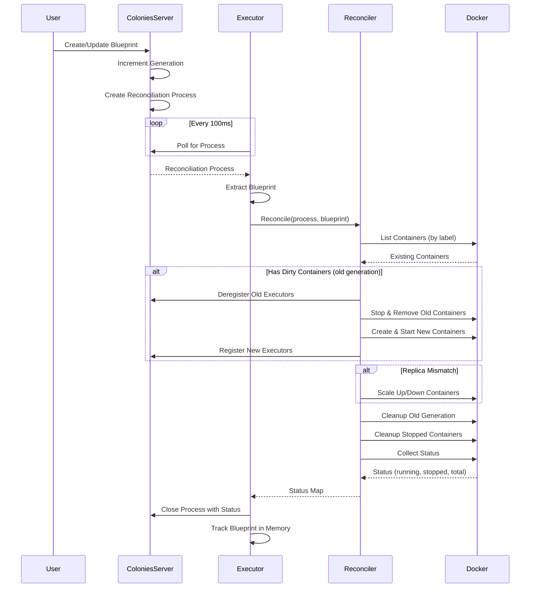
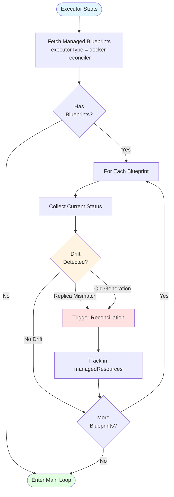
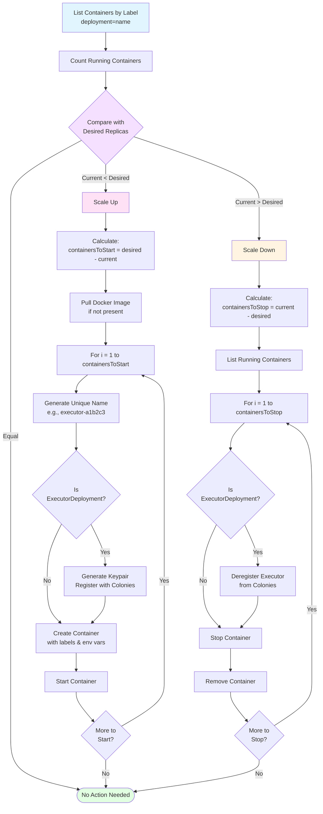
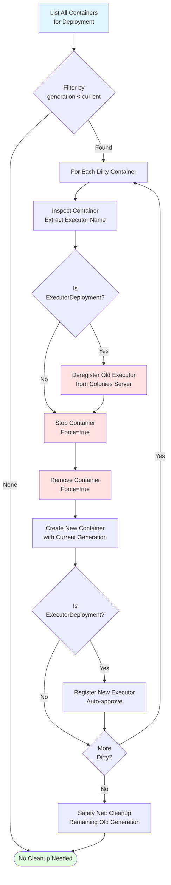
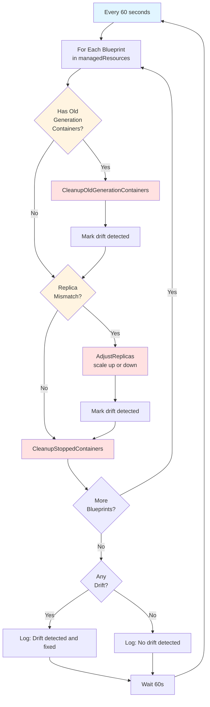
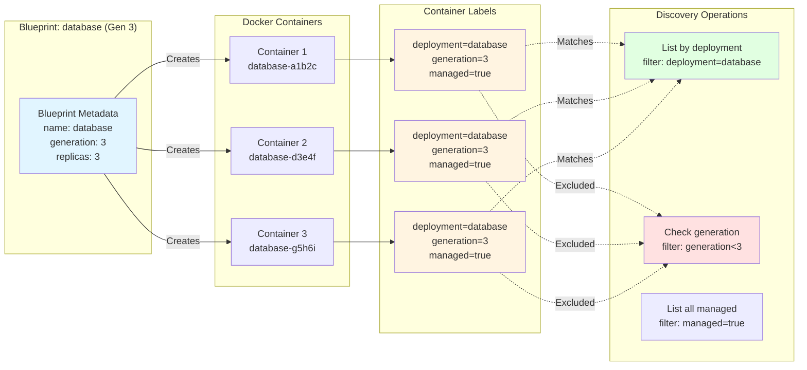

# Docker-Reconciler Reconciliation Mechanism

> **⚠️ OUTDATED**: This document describes the old background-loop based architecture.
>
> **For current architecture**, see:
> - [CRON_ARCHITECTURE.md](./CRON_ARCHITECTURE.md) - New cron-based, stateless design
> - [README.md](./README.md) - Updated user guide
> - [BLUEPRINT_CRON_LIFECYCLE.md](./BLUEPRINT_CRON_LIFECYCLE.md) - Cron lifecycle details
>
> The information below is kept for historical reference but no longer reflects how the system works.

---

## Overview (Historical)

The docker-reconciler **was** a Colonies executor that maintained desired state for Docker container deployments using background loops and startup reconciliation. This has been replaced with a cron-based, server-driven architecture.

**Core Principles:**
- **Declarative Configuration**: Users define desired state in blueprints
- **Continuous Reconciliation**: System automatically corrects drift from desired state
- **Generation-based Updates**: Zero-downtime updates using generation labels
- **Idempotent Operations**: Running reconciliation multiple times produces same result
- **Label-based Discovery**: All operations use Docker labels for container filtering

## Architecture

### System Architecture



### Blueprint Types

The reconciler supports two blueprint types:

1. **ExecutorDeployment**: Deploys executor containers with automatic registration to Colonies
   - Auto-generates keypairs for executors
   - Registers and approves executors with Colonies server
   - Manages executor lifecycle (registration/deregistration)
   - Example: Deploying multiple docker-executor instances

2. **DockerDeployment**: Deploys regular Docker containers with declarative instance specifications
   - Supports named instances with specific configurations
   - No automatic Colonies registration
   - Full container configuration control
   - Example: Deploying database or service containers

## Reconciliation Process Flow

### 1. Receiving Reconciliation Processes

The executor continuously polls the Colonies server for reconciliation work:

```go
// pkg/executor/reconciliation_loop.go
func (e *Executor) ServeForEver() {
    // Perform startup reconciliation first
    e.performStartupReconciliation()

    // Main loop: poll every 100ms for processes
    for {
        process := assignNextProcess()  // Poll Colonies server
        if process != nil {
            dispatchProcess(process)    // Route to handleReconcile()
        }
        time.Sleep(100 * time.Millisecond)
    }
}
```

**Process Data Structure:**
```go
type Process struct {
    ID           string
    FunctionSpec FunctionSpec {
        Reconciliation: {
            Action: "create" | "update" | "delete"
            New:    *Blueprint  // Desired state
            Old:    *Blueprint  // Previous state (nil for create)
        }
    }
}
```

**Entry Point:**
- `handleReconcile()` extracts blueprint from `process.FunctionSpec.Reconciliation.New`
- Routes to appropriate handler based on `blueprint.Kind`
- Tracks/untracks blueprint in `managedResources` map based on action

**Main Reconciliation Flow:**



### 2. Startup Reconciliation

Before entering the main polling loop, the executor performs startup reconciliation to ensure desired state even after restarts:



**Implementation:**
```go
// pkg/executor/startup_reconciliation.go
func (e *Executor) performStartupReconciliation() {
    blueprints := fetchManagedBlueprints()

    for _, blueprint := range blueprints {
        needsReconciliation, reason := checkReconciliationNeeded(blueprint)
        if needsReconciliation {
            triggerReconciliation(blueprint)
        }
    }
}
```

### 3. Detecting Missing Docker Containers

The reconciler detects missing containers by comparing actual state with desired state:

**Discovery Process:**
1. **List Existing Containers**: Query Docker API with label filter `colonies.deployment=<blueprint-name>`
2. **Count Replicas**: Compare actual count vs desired
3. **Scale Up If Needed**: Start missing containers

**Scaling Decision Flow:**



**Container Discovery:**
```go
// pkg/reconciler/container.go
func (r *Reconciler) listContainersByLabel(deploymentName string) ([]string, error) {
    filterArgs := filters.NewArgs()
    filterArgs.Add("label", "colonies.deployment="+deploymentName)

    containers, err := r.dockerClient.ContainerList(ctx, container.ListOptions{
        All:     true,  // Include both running and stopped containers
        Filters: filterArgs,
    })

    // Return container IDs
}
```

**Scale-Up Process (ExecutorDeployment):**
```go
if currentReplicas < spec.Replicas {
    containersToStart := spec.Replicas - currentReplicas

    for i := 0; i < containersToStart; i++ {
        // Generate unique name with hash suffix
        containerName := generateUniqueExecutorName(blueprint.Metadata.Name)

        // Pull image if needed
        pullImage(spec.Image)

        // For ExecutorDeployment: Generate keypair and register executor
        executorPrvKey := crypto.GeneratePrivateKey()
        executorID := crypto.GenerateID(executorPrvKey)
        executorName := containerName + "-" + generation

        client.AddExecutor(executor)
        client.ApproveExecutor(executorName)

        // Create and start container with injected credentials
        startContainer(spec, containerName, blueprint)
    }
}
```

### 4. Detecting Old Generation Containers

Generation-based tracking enables zero-downtime updates and drift detection:

**Generation Labels:**
Every container is labeled with:
```
colonies.deployment=<blueprint-name>
colonies.generation=<number>
colonies.managed=true
```

**Detection Process:**
```go
// pkg/reconciler/cleanup.go
func (r *Reconciler) HasOldGenerationContainers(blueprint *core.Blueprint) (bool, error) {
    currentGeneration := blueprint.Metadata.Generation
    containers := listContainersByLabel(blueprint.Metadata.Name)

    for _, container := range containers {
        containerGeneration := container.Labels["colonies.generation"]
        if containerGeneration < currentGeneration {
            return true, nil  // Found old generation container
        }
    }

    return false, nil
}
```

**Generation-Based Update Flow:**

```mermaid
stateDiagram-v2
    [*] --> Gen1: Initial Deployment<br/>(Generation 1)

    state Gen1 {
        [*] --> Running1
        Running1: 3 Containers Running<br/>generation=1
    }

    Gen1 --> Gen2: User Updates Blueprint<br/>(Generation 2)

    state Gen2 {
        [*] --> Detect: Detect Dirty Containers<br/>(generation < 2)
        Detect --> Dereg: Deregister Old Executors
        Dereg --> Remove: Stop & Remove Gen1
        Remove --> Create: Create New Containers<br/>generation=2
        Create --> Register: Register New Executors
        Register --> Running2
        Running2: 3 Containers Running<br/>generation=2
    }

    Gen2 --> Gen3: User Updates Blueprint<br/>(Generation 3)

    state Gen3 {
        [*] --> Detect2: Detect Dirty Containers<br/>(generation < 3)
        Detect2 --> Dereg2: Deregister Old Executors
        Dereg2 --> Remove2: Stop & Remove Gen2
        Remove2 --> Create2: Create New Containers<br/>generation=3
        Create2 --> Register2: Register New Executors
        Register2 --> Running3
        Running3: 3 Containers Running<br/>generation=3
    }

    Gen3 --> [*]

    note right of Gen1: Old containers automatically<br/>cleaned up during update
    note right of Gen2: Zero-downtime:<br/>new containers start<br/>before old ones stop
```

**Dirty Container Cleanup Process:**



**Implementation:**
```go
dirtyContainers := findDirtyContainers(existingContainers, blueprint.Metadata.Generation)

for _, containerID := range dirtyContainers {
    // Get old executor name from container environment
    oldExecutorName := extractEnvVar(containerID, "COLONIES_EXECUTOR_NAME")

    // Deregister old executor
    client.RemoveExecutor(colonyName, oldExecutorName, colonyOwnerKey)

    // Remove dirty container
    stopAndRemoveContainer(containerID)

    // Recreate with new generation
    startContainer(spec, containerName, blueprint)
}
```

### 5. Self-Healing Loop (Optional)

A background goroutine can continuously monitor for drift and automatically remediate issues.

**Configuration:**
```go
type SelfHealingConfig struct {
    Enabled       bool          // Default: false
    CheckInterval time.Duration // Default: 60 seconds
}
```

**Self-Healing Process:**



**Simplified Implementation:**
```go
// pkg/executor/self_healing.go
func (e *Executor) detectAndFixDrift(blueprint *core.Blueprint) bool {
    driftDetected := false

    // 1. Check and clean up old generation containers
    if hasOld, _ := e.reconciler.HasOldGenerationContainers(blueprint); hasOld {
        e.reconciler.CleanupOldGenerationContainers(blueprint)
        driftDetected = true
    }

    // 2. Check and adjust replica count
    status := e.reconciler.CollectStatus(blueprint)
    runningInstances := status["runningInstances"].(int)
    desiredReplicas := e.getDesiredReplicas(blueprint)

    if runningInstances != desiredReplicas {
        e.reconciler.AdjustReplicas(blueprint)
        driftDetected = true
    }

    // 3. Clean up stopped containers
    e.reconciler.CleanupStoppedContainers()

    return driftDetected
}
```

**Drift Types Detected:**
- **Replica Mismatch**: Running containers ≠ desired replicas
- **Generation Mismatch**: Containers with outdated generation labels
- **Stopped Containers**: Containers in "exited" state

**Auto-Remediation Actions:**
- Directly calls cleanup and scaling functions
- No synthetic processes created
- No full reconciliation triggered
- Minimal work to fix drift

### 6. Cleanup Operations

The reconciler performs several cleanup operations to maintain system health:

#### Old Generation Cleanup
```go
// pkg/reconciler/cleanup.go
func (r *Reconciler) CleanupOldGenerationContainers(blueprint *core.Blueprint) error {
    currentGeneration := blueprint.Metadata.Generation
    containers := listAllContainersForDeployment(blueprint.Metadata.Name)

    for _, container := range containers {
        if container.Generation < currentGeneration {
            // Deregister executor (if ExecutorDeployment)
            if blueprint.Kind == "ExecutorDeployment" {
                client.RemoveExecutor(containerName)
            }

            // Remove container
            dockerClient.ContainerRemove(container.ID, Force: true)
        }
    }
}
```

#### Stopped Container Cleanup
```go
func (r *Reconciler) CleanupStoppedContainers() error {
    containers := listManagedContainers(All: true)

    for _, container := range containers {
        if container.State != "running" {
            dockerClient.ContainerRemove(container.ID, Force: true)
        }
    }
}
```

#### Stale Executor Cleanup
```go
func (r *Reconciler) CleanupStaleExecutors(deploymentName, executorType string) error {
    // Get all executors from Colonies server
    executors := client.GetExecutors(colonyName)

    // Get all running containers
    containerNames := listRunningContainerNames(deploymentName)

    // Remove executor registrations without containers
    for _, executor := range executors {
        if !containerNames[executor.Name] {
            client.RemoveExecutor(executor.Name)
        }
    }
}
```

### 7. Status Collection

After successful reconciliation, the reconciler collects and reports current status:

```go
// pkg/reconciler/status.go
func (r *Reconciler) CollectStatus(blueprint *core.Blueprint) (map[string]interface{}, error) {
    containers := listContainersByLabel(blueprint.Metadata.Name)

    totalInstances := 0
    runningInstances := 0
    stoppedInstances := 0

    for _, containerID := range containers {
        inspect := dockerClient.ContainerInspect(containerID)
        totalInstances++

        if inspect.State.Running {
            runningInstances++
        } else {
            stoppedInstances++
        }
    }

    return map[string]interface{}{
        "totalInstances":   totalInstances,
        "runningInstances": runningInstances,
        "stoppedInstances": stoppedInstances,
    }, nil
}
```

**Status Reporting:**
- Status returned to Colonies server via `CloseWithOutput()`
- Server updates `blueprint.Status` field
- Users can query blueprint status via CLI or API

## Key Design Patterns

### 1. Idempotent Reconciliation
Running reconciliation multiple times produces the same result. No side effects from repeated reconciliation.

### 2. Label-based Discovery
All container operations use Docker labels for filtering:
- `colonies.deployment=<name>` - Identifies deployment
- `colonies.generation=<number>` - Tracks blueprint version
- `colonies.managed=true` - Marks reconciler-managed containers

**Container Labeling System:**



### 3. Generation-based Updates
Blueprint generation number enables:
- Detection of outdated containers
- Zero-downtime updates
- Rolling updates
- Automatic cleanup of old versions

### 4. Zero-trust Security
- Executor keypairs generated per container
- Automatic registration with Colonies server
- Cryptographic identity for each executor
- No shared credentials

### 5. Network Aliases
Containers get network alias matching blueprint name:
```go
networkConfig := &network.NetworkingConfig{
    EndpointsConfig: map[string]*network.EndpointSettings{
        "colonies_default": {
            Aliases: []string{blueprint.Metadata.Name},
        },
    },
}
```

This enables service discovery (e.g., `http://database:5432` instead of `http://database-abc123:5432`)

## Example Scenarios

### Scenario 1: Initial Deployment

1. User creates ExecutorDeployment blueprint with `replicas: 3`
2. Colonies server dispatches reconciliation process to docker-reconciler
3. Reconciler pulls Docker image
4. Reconciler starts 3 containers with unique names
5. For each container:
   - Generate keypair
   - Register executor with Colonies
   - Auto-approve executor
   - Inject credentials as environment variables
6. Reconciler collects status and reports back
7. Blueprint tracked in `managedResources` map

### Scenario 2: Scaling Up

1. User updates blueprint to `replicas: 5`
2. Blueprint `metadata.generation` incremented to 2
3. Reconciliation process dispatched
4. Reconciler lists existing containers (finds 3)
5. Reconciler starts 2 new containers with generation=2
6. Total: 5 running containers
7. Status reported back to server

### Scenario 3: Updating Configuration

1. User updates blueprint with new image or environment variables
2. Blueprint `metadata.generation` incremented to 3
3. Reconciliation process dispatched
4. Reconciler finds containers with generation < 3 (dirty containers)
5. For each dirty container:
   - Deregister old executor
   - Stop and remove container
   - Start new container with generation=3
   - Register new executor
6. Old generation cleanup removes any stragglers
7. Status reported back

### Scenario 4: Container Crash (Self-Healing)

1. Container crashes and stops
2. Self-healing loop detects drift (running: 2, desired: 3)
3. Self-healing calls `AdjustReplicas()`
4. New container started to replace crashed one
5. System automatically returns to desired state

### Scenario 5: Manual Container Deletion

1. User manually deletes a container with `docker rm -f`
2. Self-healing loop detects replica mismatch
3. New container started automatically
4. Stale executor cleanup removes orphaned registration

## Configuration

### Environment Variables

```bash
# Executor Configuration
COLONIES_SERVER_HOST=localhost
COLONIES_SERVER_PORT=50080
COLONIES_INSECURE=true
COLONIES_COLONY_NAME=dev
COLONIES_PRVKEY=<executor-private-key>

# Self-Healing Configuration (optional)
ENABLE_SELF_HEALING=true
SELF_HEALING_INTERVAL=60s
```

### Blueprint Specification

**ExecutorDeployment Example:**
```json
{
  "kind": "ExecutorDeployment",
  "metadata": {
    "name": "docker-executor",
    "namespace": "default",
    "generation": 1
  },
  "spec": {
    "image": "colonyos/docker-executor:latest",
    "replicas": 3,
    "executorType": "docker-executor",
    "env": {
      "COLONIES_SERVER_HOST": "colonies-server",
      "COLONIES_SERVER_PORT": "50080"
    }
  }
}
```

**DockerDeployment Example:**
```json
{
  "kind": "DockerDeployment",
  "metadata": {
    "name": "database",
    "generation": 1
  },
  "spec": {
    "instances": [
      {
        "name": "postgres-primary",
        "image": "postgres:15",
        "environment": {
          "POSTGRES_PASSWORD": "secret"
        },
        "ports": [
          {"host": 5432, "container": 5432}
        ]
      }
    ]
  }
}
```

## Troubleshooting

### Common Issues

**1. Containers not starting:**
- Check image availability: `docker pull <image>`
- Check Docker daemon logs: `docker logs <container>`
- Verify network configuration

**2. Stale executor registrations:**
- Run cleanup: Reconciler automatically runs `CleanupStaleExecutors()`
- Manual cleanup: `colonies executor remove --name <executor-name>`

**3. Old generation containers persist:**
- Check logs for cleanup errors
- Manual cleanup: `docker ps -a --filter label=colonies.deployment=<name>`
- Remove manually: `docker rm -f <container-id>`

**4. Self-healing not working:**
- Verify `ENABLE_SELF_HEALING=true`
- Check executor logs for drift detection messages
- Verify blueprint in `managedResources` map

## Performance Considerations

- **Polling Interval**: 100ms for process assignment (configurable)
- **Self-Healing Interval**: 60s default (adjustable based on needs)
- **Concurrent Reconciliation**: One process at a time per executor
- **Image Pulling**: Only pulls if not present locally
- **Label Queries**: Efficient Docker API filtering

## Security Considerations

- Executor credentials generated per container (unique keypairs)
- No shared secrets between containers
- Colony owner privileges required for executor registration
- Cryptographic identity verification for all operations
- Isolated network namespaces per container

## Future Enhancements

- Health check integration
- Resource limits enforcement (CPU, memory)
- Multi-node orchestration support
- Metrics collection and export
- Advanced scheduling constraints
- Rolling update strategies (blue-green, canary)
